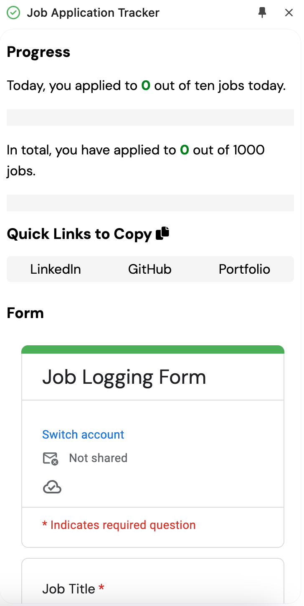

## Welcome to Job App Extension! 
##### Version 1.0

This is a readme file that explains how the Job App Side Panel Extension works. 

I know how time-consuming applying to jobs can be, so I decided to make a side panel extension that persists across pages to aid in the job application process. This is what the interface looks like:

The above image shows you how the interface is laid out. 

At the very top of the extension, under the progress heading, you will see two progress bars. The first progress bar tracks your progress of the whole day. This will count the number of jobs you applied to throughout the whole day.

The second progress bar counts you applications for all time (as long as they are in the google spreadsheet linked to the google form below the quick links section).

Next up is the quick links section. This section allows for easy copying of your social links in case applications ask for them. This allows you to stay on the job application page, and cuts down on time that would be used to search for your social links. Each button can be clicked to copy the corresponding social link.

Below this is the job application form. This is an embedded google form, which allows you to input data about the job you just applied to in the main tab. This will save you time because you no longer have to navigate to another page with a google sheet to input information about the job you just applied to.

##### Why did you make Job App Extension? 
I made job app extension because I wanted to eliminate the amount of time lost when an applicant has to navigate to another page to find the relevant links for their application, or when they have to record their job applications in a spreadsheet on a seperate tab.

##### Will you be updating Job App Extension?

Yes, this is only V 1.0. My plan is to use this extension and see what I need to improve on. I hope one day I can release this to the Chrome Extension Store for other job applicants in need of an extension that streamlines their job application process, but this would require more customization abilities that will hopefully be implemented in the next couple of versions. 

For the time being, this app is very much "personal-use" and what I mean by that is there is no way to customize the links you want to copy using the buttons, or the form you would like to use to input your job application information without cloning the repo and writing your own links in place of the ones that I am using. 

I don't think that would be very convenient for public use, which is why I will gauge how useful it is for myself and then hopefully implement features that the public would find useful in the next few versions.